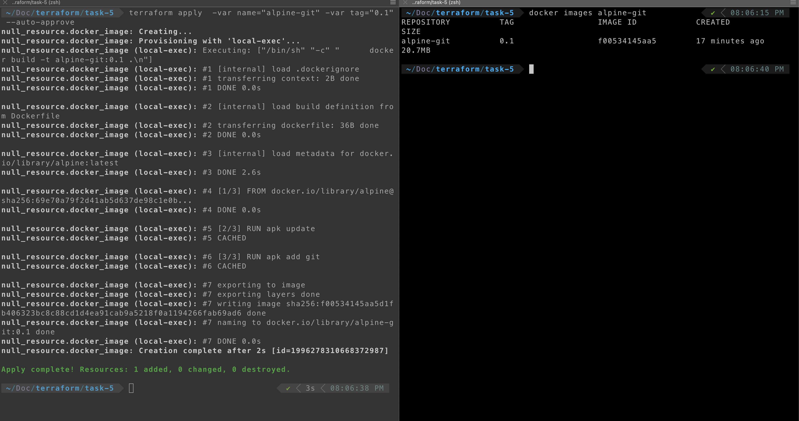
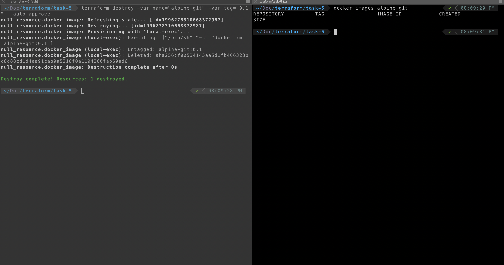

# Solution-5

The code for this task can be found [here]

For this task you need to have **Docker**  installed on your system If you don't have docker Install it by following this [guide](https://docs.docker.com/engine/install/)


## Task

Now type the below command in the terminal in order to create the resources terraform

```
terraform init
```

```
terraform apply  -var name="alpine-git" -var tag="0.1" --auto-approve
```



## Tear down

To remove the image that we have created using the terraform type the below command in the terminal

```
terraform destroy -var name="alpine-git" -var tag="0.1" --auto-approve
```



## Reference 

1. https://dev.to/jmarhee/upgrading-terraform-destroy-time-provisioners-50p7