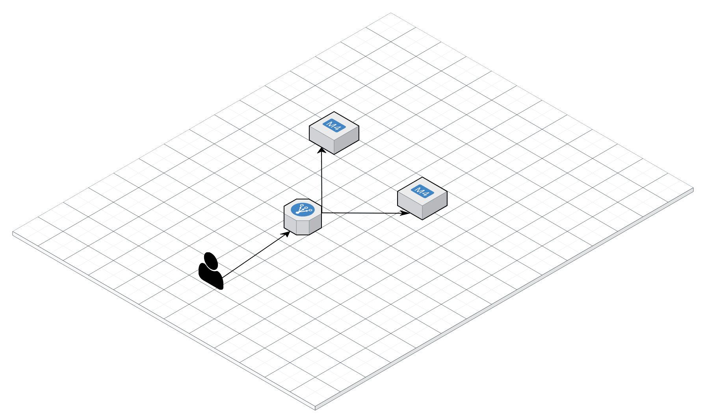

## Task-2

- [ ]  For this Task you have to create two droplet in the [Digital-Ocean](https://www.digitalocean.com/) using Terraform
- [ ]  Install the [Nginx](https://www.nginx.com/) on the created droplet
- [ ]  Replace the default `nginx-website` with the `new-website`
- [ ]  Add the Load balancer in front of the created droplets

The Final **Architecture** should be like the below diagram

## 🏆 Bonus Task

- [ ] Map the IP address of the Load balancer to the Custom Domain 

[Solution](solution2.md)