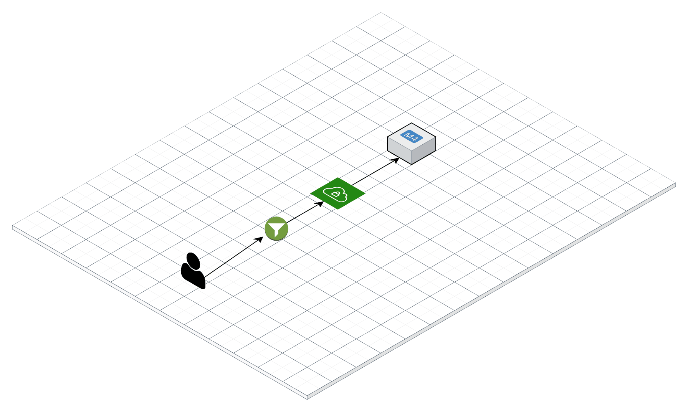

## Task-4

- [ ] Create the Custom VPC  using Terraform
- [ ] Add the firewall rules to allow traffic at  `port-80` at the above-created VPC
- [ ] Create the compute instance in the [Google-cloud](https://cloud.google.com/compute)  at inside the created VPC
- [ ]  Install the [Nginx](https://www.nginx.com/) on the created instance

The final **Architecture** should be like the below diagram

> I have used GCP to do this task you can use AWS,Azure to achieve the same output 

[Solution](solution4.md)